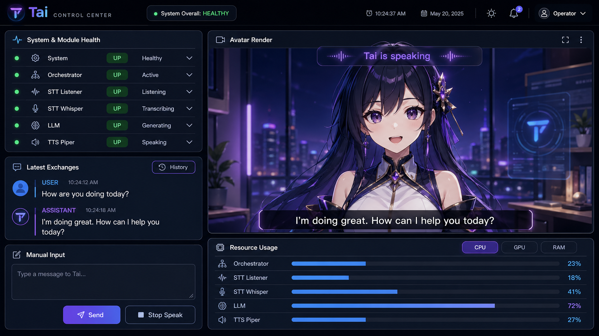

# V2 UI Functional Spec

## 1. Purpose

The Tai V2 UI is the first web interface for monitoring and interacting with the local Tai assistant system.

The UI must provide a clear, modern and responsive control center that fits in the screen height (no scroll down allowed to show the dashboard) focused on:

- system and module health
- live conversation state
- latest user transcription
- latest assistant subtitle
- manual user input
- speech interruption
- avatar-centered interaction
- placeholder zones for future resource usage and avatar streaming
- modular dashboard panels that are ready for enlarged or isolated presentation modes

The goal of V2.0.0 is to expose a useful UI driven by the orchestrator state, without introducing a dedicated UI gateway yet.

---

## 2. Scope

### In scope for V2.0.0

The UI must display and interact with:

- global conversation status
- system/module overview statuses
- latest user utterance
- latest assistant utterance
- manual text input
- stop speak action
- conversation history loaded on demand
- placeholder resource usage section
- placeholder avatar render section
- fixed dashboard panels designed for future pop-out or enlarged presentation modes
- avatar render panel controls, including expand and contextual overflow actions

### Out of scope for V2.0.0

The following elements are out of scope for V2.0.0. Some may be mocked, static or placeholder-driven when useful:

- real CPU usage
- real GPU usage
- real RAM usage
- per-module resource usage
- avatar stream integration
- release/build metadata
- advanced module details
- user-driven drag-and-drop panel rearrangement
- persistent custom dashboard layouts
- arbitrary runtime dashboard layout editing
- dedicated UI gateway
- RabbitMQ event bus

These are expected to become more complete once `tai-ui-gateway` exists.

---

## 3. Product Direction

The UI should feel like a **local AI control center**, not like a generic admin console.

The interface should make it immediately clear:

- whether Tai is listening, thinking or speaking
- whether the system is healthy
- what the user last said
- what Tai last said
- whether speech can be interrupted
- which module is currently active or degraded

The avatar should become the visual center of the experience.

---

## 4. Design Reference

The following mockup is the visual reference for the target V2 dashboard layout.

<a href="assets/tai-ui-v2-dashboard-mockup.png">
  
</a>

The image is intentionally kept as a reference mockup. The implementation can evolve as long as it preserves the same functional priorities:

- system and module health overview
- avatar-centered conversation focus
- latest user and assistant utterances
- manual user input
- speech interruption control
- placeholder zones for resources and avatar streaming

---

## 5. Panel Modularity and Pop-out Readiness

### Purpose

The dashboard panels should be implemented as modular UI units.

Each panel should be designed so it can eventually be displayed outside of its default dashboard position, for example in an enlarged view, modal, drawer, dedicated route, or pop-out container.

This is a UI composition principle, not a requirement for user-customizable dashboards.

### Fixed dashboard layout

V2.0.0 should keep a fixed dashboard layout.

The UI should not provide:

- drag-and-drop panel rearrangement
- arbitrary dashboard layout editing
- persistent user-defined panel layouts
- a free-form widget grid

The implementation should avoid behaving like a generic dashboard builder.

### Panel implementation expectations

Panels should avoid hard dependencies on their exact position in the dashboard grid.

A panel should:

- receive display data through clear props, state or view-model inputs
- keep its local UI actions scoped to its own responsibility
- be reusable in a larger or isolated presentation mode
- avoid duplicating business logic between dashboard and enlarged views
- preserve graceful empty, loading and unavailable states when rendered alone

Panel enlargement or pop-out behavior may be implemented progressively. The important V2.0.0 requirement is that panel components are structured in a way that does not block this evolution.

### Panel controls

When a panel exposes top-right controls, they should follow this distinction:

- an expand control is used for direct enlargement of the panel or its primary content
- an overflow menu is used for secondary contextual actions scoped to that panel

Panel overflow menus should not contain global application settings unless the panel itself is explicitly a settings panel.

---

## 6. Header

### Purpose

The header provides global context and high-level operational status.

### Content

The header should include:

- Tai logo / product name
- global system health badge
- current time
- optional user/operator indicator
- optional notification/settings icons

### Global system health badge

Example labels:

- `System overall: Healthy`
- `System overall: Degraded`
- `System overall: Down`

Visual mapping:

| Health | Color |
|---|---|
| `UP` / healthy | green |
| `DEGRADED` | orange |
| `DOWN` | red |
| `DISABLED` / unavailable | grey |

---

## 7. Panel 1 — System & Module Health

### Purpose

Display a compact overview of the system and modules.

This panel is used to answer:

- Is the system healthy?
- Which module is active?
- Which module is degraded or down?
- What is each module currently doing?

### Content

Each line should display:

- module name
- health indicator
- runtime state text
- affordance for details

Example:

```text
System          UP      Healthy        >
Orchestrator    UP      Active         >
STT Listener    UP      Listening      >
STT Whisper     UP      Transcribing   >
LLM             UP      Generating     >
TTS Piper       UP      Speaking       >
```

### Displayed modules

The UI should support at least:

- `SYSTEM`
- `ORCHESTRATOR`
- `STT_LISTENER`
- `STT_WHISPER`
- `LLM`
- `TTS_PIPER`
- `UI_GATEWAY`
- `AVATAR`

Modules that are not implemented or not managed yet may be shown as `DISABLED` or hidden depending on the final UI choice.

### Health status

The module health status is intended for color and severity.

Expected values:

- `UP`
- `DEGRADED`
- `DOWN`
- `DISABLED`

### Runtime state

The runtime state is a short display string.

Examples:

| Module | Example states |
|---|---|
| `SYSTEM` | `Healthy`, `Degraded`, `Offline` |
| `ORCHESTRATOR` | `Active`, `Idle`, `Error` |
| `STT_LISTENER` | `Listening`, `Recording`, `Deaf` |
| `STT_WHISPER` | `Idle`, `Transcribing` |
| `LLM` | `Idle`, `Generating` |
| `TTS_PIPER` | `Silent`, `Speaking`, `Synthesizing` |
| `UI_GATEWAY` | `Disabled`, `Unavailable` |
| `AVATAR` | `Disabled`, `Streaming`, `Unavailable` |

The UI may truncate long runtime state labels.

### Module details

Clicking the right arrow on a module line should open a detailed view for that module.

For V2.0.0, details can be simple or partially implemented.

Expected behavior:

```text
click module arrow
  → request module details from orchestrator
  → replace or overlay panel content with module detail view
  → show back button to return to module overview
```

The detailed view may include:

- health
- state
- last checked time
- last processed correlation id
- last process duration
- module-specific technical fields
- last error

Module details are not part of the live UI snapshot. They are loaded on demand.

---

## 8. Panel 2 — Latest Exchanges

### Purpose

Show the latest known user and assistant utterances.

This panel gives quick textual context without opening the full conversation history.

### Content

The panel should include:

- latest user transcription
- latest assistant message state or short summary
- button to open the full conversation history

### Latest user utterance

Displays:

- role: `USER`
- text
- timestamp
- status when useful

Example:

```text
USER · 10:24:12
How are you doing today?
```

### Latest assistant utterance

The assistant utterance should not be duplicated as a large card if it is already displayed as a subtitle over the avatar.

Recommended V2 layout:

- keep latest user transcription in the panel
- use the avatar subtitle overlay for the assistant utterance
- optionally keep a small assistant status line if needed

### History button

A `History` button should open a conversation history view.

Preferred UI behavior:

- drawer
- modal
- dedicated overlay

The history should be loaded on demand.

An iframe-like approach is possible later if the history is served by another module, but the initial target should be a native UI view.

---

## 9. Conversation History

### Purpose

Display previous conversation turns.

The history is not part of the live state snapshot.

It is loaded through a dedicated endpoint when the user opens the history view.

### Content per item

Each history item should include:

- user text
- assistant text
- outcome
- started time
- completed time
- optional correlation id for debugging

Example:

```text
USER
Can you summarize the last system update?

ASSISTANT
Sure. The last update improved Whisper latency and added health aggregation.

Outcome: COMPLETED
```

### Pagination / scroll

The history should support progressive loading.

Preferred behavior:

```text
open history
  → load latest N turns

scroll up
  → load older turns
```

Cursor-based pagination is preferred over page numbers.

---

## 10. Panel 3 — Manual Input

### Purpose

Allow the user to send a typed message to Tai.

This is the UI equivalent of a user utterance accepted without STT.

### Content

The panel should include:

- multiline text input
- character counter
- send button

### Behavior

When the user sends a message:

```text
user enters text
  → click Send
  → message is sent to the system
  → UI clears the input if accepted
  → Tai moves to THINKING
```

### Validation

The send action should be disabled when:

- the input is empty
- the input contains only whitespace
- the input exceeds the configured character limit

Suggested character limit:

```text
2000 characters
```

---

## 11. Panel 4 — Stop Speak

### Purpose

Allow the user to interrupt Tai while she is speaking, preparing speech or thinking.

### Content

A single prominent button:

```text
Stop Speak
```

### Behavior

Clicking the button should request an interruption of the current assistant flow.

For V2.0.0, this covers both active speech playback and active assistant generation. It maps conceptually to the same kind of interruption caused by user speech start, without creating a new conversation turn.

The UI sends the request to:

```http
POST /events/ui/stop-speak
```

Request:

```json
{
  "eventId": "generated-uuid",
  "occuredAt": "2026-05-02T14:41:35.824Z",
  "correlationId": "string",
  "source": "UI"
}
```

The endpoint returns no response body. The user-visible result is reflected through the next live UI state snapshot.

### Visual state

The button should be contextual:

| Tai state | Button state |
|---|---|
| `SPEAKING` | enabled, red |
| `THINKING` | enabled, secondary or danger depending on final visual choice |
| `LISTENING` | disabled or neutral |
| `IDLE` | disabled or neutral |

The UI should avoid showing a permanent alarming red action when Tai is silent.

---

## 12. Main Avatar Panel

### Purpose

The avatar panel is the visual center of the UI.

It should display:

- avatar render area
- global conversation status overlay
- assistant subtitle overlay
- stream status placeholder
- avatar render panel controls

### Avatar render panel controls

The avatar render panel should expose two distinct top-right controls:

- an expand control
- a contextual overflow menu represented by vertical ellipsis

The expand control is a primary visual action. It is used to enlarge the avatar render area within the UI, open a larger presentation mode, or route the user to a dedicated avatar view.

The contextual overflow menu is scoped to avatar rendering only. It should not contain global application settings, conversation controls, model settings or voice settings.

Suggested overflow menu entries:

- `View avatar module details`
- `Refresh render`
- `Toggle diagnostics overlay`
- `Open avatar view`

For V2.0.0, entries that depend on a real avatar stream may be disabled, mocked or hidden until avatar integration exists.

The avatar panel is the first visible example of the general panel modularity and pop-out readiness direction. Its controls should make that direction clear without introducing full dashboard layout customization.

### Conversation status overlay

A large status label should be displayed above the avatar render.

Expected statuses:

- `Tai is listening`
- `Tai is thinking`
- `Tai is speaking`
- `Tai is idle`
- `Tai is unavailable`

The status should be derived from the global conversation status.

### Assistant subtitle overlay

The latest assistant utterance should be displayed as a subtitle near the bottom of the avatar render area, similar to a movie subtitle.

This subtitle should display the latest assistant text even if the assistant speech was interrupted.

Example:

```text
I'm doing great. How can I help you today?
```

### Avatar render placeholder

For V2.0.0, the avatar render may be a placeholder or static mock.

Future integration may replace the placeholder with a streamed avatar render from a dedicated module.

### Stream state

The avatar panel should support these future states:

- `Streaming`
- `Loading`
- `Unavailable`
- `Disabled`

For V2.0.0, these may be mocked.

---

## 13. Panel 5 — Resource Usage

### Purpose

Display system resource usage.

For V2.0.0, this panel can be mocked or placeholder-driven.

### Target content

Eventually, the panel should show:

- CPU usage
- GPU usage
- RAM usage
- per-module usage breakdown

### Interaction concept

The user may select one resource type:

- CPU
- GPU
- RAM

The per-module graphs then display usage for the selected resource type.

Example:

```text
[ CPU ] [ GPU ] [ RAM ]

Orchestrator   23%
STT Listener   18%
STT Whisper    41%
LLM            72%
TTS Piper      27%
```

This interaction does not need to be implemented in V2.0.0.

---

## 14. Conversation Status

### Purpose

Expose a single user-facing conversation status centered on Tai.

This is not a raw technical status.

Expected values:

- `IDLE`
- `LISTENING`
- `THINKING`
- `SPEAKING`
- `ERROR`

### Meaning

| Status | Meaning |
|---|---|
| `IDLE` | Tai is not actively listening, thinking or speaking |
| `LISTENING` | Tai is ready for user input |
| `THINKING` | Tai is processing, transcribing or generating |
| `SPEAKING` | Tai is preparing speech or speaking |
| `ERROR` | Tai cannot currently proceed normally |

### UI labels

Suggested labels:

| Status | Label |
|---|---|
| `IDLE` | `Tai is idle` |
| `LISTENING` | `Tai is listening` |
| `THINKING` | `Tai is thinking` |
| `SPEAKING` | `Tai is speaking` |
| `ERROR` | `Tai needs attention` |

---

## 15. Live State Update Strategy

The UI should receive a lightweight live state snapshot.

The snapshot should include only what is required for live rendering:

- generated time
- version
- conversation status
- module overview map
- latest user utterance
- latest assistant utterance

The snapshot should not include:

- full conversation history
- module technical details
- resource usage details
- avatar stream payload

### Snapshot refresh

The UI should receive a full snapshot whenever a significant state change happens.

Examples:

- user speech started
- user transcript accepted
- assistant reply accepted
- assistant speech started
- assistant speech completed
- conversation turn completed
- system health refreshed

### Why full snapshots

Full snapshots are preferred for V2.0.0 because they are:

- simpler to consume
- robust to missed events
- easy to recover after reconnect
- easy to move later to `tai-ui-gateway`

---

## 16. On-Demand Data

Some data should be loaded only when requested by the user.

### Conversation history

```text
user opens history
  → UI requests conversation history
  → UI renders latest page
  → UI loads older pages on scroll
```

### Module details

```text
user clicks module arrow
  → UI requests module detail
  → UI renders module-specific diagnostics
```

This keeps the live state small and avoids pushing rarely used debug data.

---

## 17. Responsiveness

### Desktop

Desktop is the primary target.

Recommended layout:

- left column: health, latest exchanges, manual input
- right/main area: avatar render
- bottom area: resources

### Tablet

Tablet layout may stack panels:

```text
avatar
health
latest exchanges
manual input
resources
```

### Mobile

Mobile should use tab-based navigation.

Suggested tabs:

- Overview
- Conversation
- Health
- Resources
- Avatar

The avatar and conversation status should remain easy to access.

---

## 18. Visual Guidelines

### Style

Target style:

- modern dark dashboard
- subtle neon accents
- rounded panels
- clear spacing
- high contrast text
- strong but restrained use of color

### Color conventions

| Meaning | Suggested color |
|---|---|
| Healthy / active / completed | green |
| Processing / listening / informational | blue |
| Assistant / avatar / speaking accent | purple |
| Warning / degraded | orange |
| Error / danger action | red |
| Disabled / unavailable / idle | grey |

### Typography

The UI should prioritize readability.

Important text such as subtitles, user transcript and conversation status must remain readable at a glance.

---

## 19. Failure and Empty States

### Orchestrator disconnected

If the UI loses connection with the orchestrator:

- keep the last known state visible
- visually mark it as stale/disconnected
- show reconnecting status
- avoid clearing the whole screen

### No conversation yet

Display empty states:

```text
No user message yet
No assistant reply yet
```

### Module unavailable

Display:

- grey or red health indicator depending on status
- short state label
- details available if the module can be queried

### Avatar unavailable

Display a graceful placeholder:

```text
Avatar stream unavailable
```

---

## 20. V2.0.0 Data Ownership

For V2.0.0:

- the orchestrator owns the UI projection
- the orchestrator exposes the live UI state
- the UI consumes the orchestrator state
- resource and avatar data may be mocked

For V2.1.0:

- `tai-ui-gateway` is expected to take ownership of the UI projection

For V2.2.0:

- RabbitMQ is expected to become the event transport layer for system-wide projections

---

## 21. Target User Experience

The user should be able to open the UI and immediately understand:

- Tai is online
- Tai is listening/thinking/speaking
- the system modules are healthy
- what the user last said
- what Tai last replied
- whether Tai can be interrupted
- whether the avatar/render layer is available

The UI should feel responsive, alive and useful even before advanced resource monitoring and avatar streaming are fully implemented.
